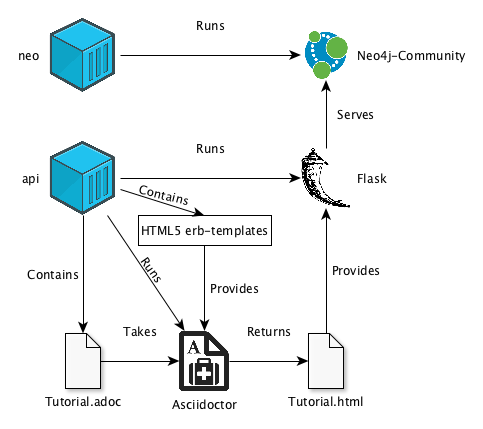
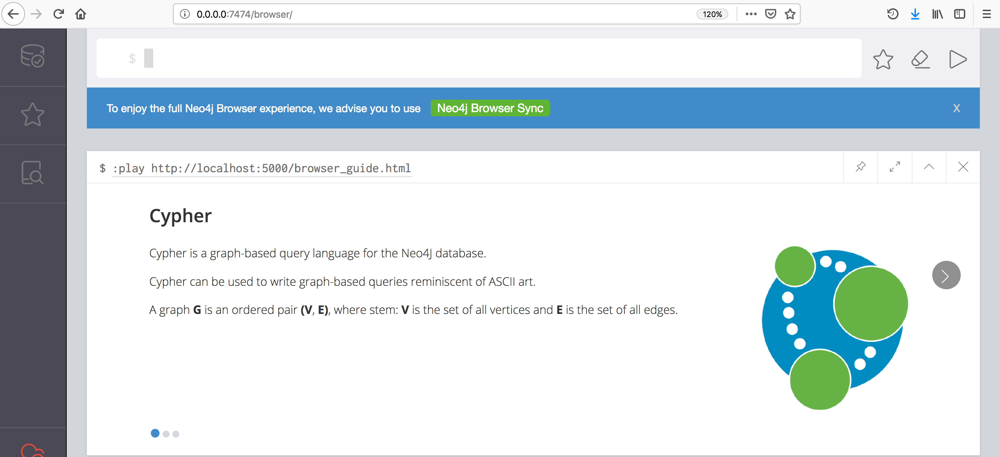

Creating a Cypher Browser Guide
===============================

[Neo4J](https://neo4j.com/) is a graph-based database that currently enjoys the highest popularity.
With the Neo4J-browser it is possible to create browser-guides.
With this browser-guide it is possible to run through interactive [Cypher](https://neo4j.com/developer/cypher-query-language/)-tutorials within the Neo4J-browser.
This project explains the local development of the browser-guides for the Neo4J-browser. [Docker](https://www.docker.com/) is used for the 
development.
In addition to the specific problems that can occur during development with Docker, the [article](https://neo4j.com/developer/guide-create-neo4j-browser-guide/) presented by Neo4J on the development of a browser
 guide is also improved and simplified.

What you need
-------------
The only requirement is that [Docker](https://docs.docker.com/install/) and [Docker Compose](https://docs.docker.com/compose/install/) are installed on the local machine.
Make sure that both are installed with the current version.

How this project is structured
------------------------------

The general idea is to package the development of the browser-guide in two containers.
The first container (neo) contains only the Neo4J community application.
The second container (api) then contains the different components to develop the guide.
This includes [Asciidoctor](https://asciidoctor.org/) and a [Flask](http://flask.pocoo.org/) server.
Asciidoctor is an application to generate HTML files from AsciiDoc files.
In order to generate HTML files with Asciidoctor, which can also be used within the Neo4J-browser, the so-called [HTML5 erb-templates](https://github.com/asciidoctor/asciidoctor-backends/tree/master/erb/html5) are provided.
Asciidoctor then translates any AsciiDoc file to HTML. 
This HTML file is then passed on to the running Flask server. 
The Flask server provided by api also has CORS activated. 
Flask can be accessed from the Neo4j-browser. 
Since the containers neo and api are located in the same network via Compose it is possible to address Flask via `http://localhost:5000/<file.html>` 
without changing `browser.remote_content_hostname_whitelist` in `neo4j.conf`. 

Let everything run
------------------

To run both containers navigate to the same directory where the `docker-compose.yml` is located and use the following command:

    $ docker-compose up

Executing this command starts the containers `neo4j-browser-guide_neo_1` and `neo4j-browser-guide_api_1`.
The container `neo4j-browser-guide_neo_1` will open the Neo4J-browser.
The Neo4J-browser can then be accessed via `http://localhost:7474`.
The container `neo4j-browser-guide_api_1` starts a Flask server.
This server can be reached via `http://localhost:5000`.

Run the example
---------------

An example of a browser guide can be found in the file `browser_guide.adoc`.
The syntax of the AsciiDoc files can be found [here](https://asciidoctor.org/docs/asciidoc-syntax-quick-reference/).
A slide can be created between the `== sections` in the `browser_guide.adoc`.

To create an HTML file from the `browser_guide.adoc` you can use the `create_html.sh` script inside `neo4j-browser-guide_api_1`.
The container `neo4j-browser-guide_api_1` can be entered by the following command.

    $ docker exec -it neo4j-browser-guide_api_1 bash

Then navigate to the directory `/api` using:

    $ cd code/api

Then you are in the correct directory of the container and can start creating the HTML file.
To do this `create_html.sh` can be used as follows:

    $ ./create_html.sh adoc/browser_guide.adoc html/browser_guide.html

This command will store a corresponding HTML file in the `/html` directory.
This file can then be requested from the Flask server at `http://localhost:5000/browser_guide.html`.

The browser-guide can then be called via the Neo4J-browser. To do this, the Neo4J-browser must first be opened via `http://localhost:7474`.
Then the browser-guider can be requested via the command line of the Neo4J-browser as follows:

    $ :play http://localhost:5000/browser_guide.html

The result should look like this:

Create your own browser guide
---------------------------------------------------------------

If you use this project to create your own browser guide, please note the following:

* All new AsciiDoc files must be stored in the folder `/adoc`
* All new HTML files must be stored in the folder `/html`
* A new HTML file can be requested via the Flask server using: `http:localhost:5000/<new_file.html>`
* A new browser-guide can then be used in the Neo4J-browser as follows: `play http:localhost:5000/<new_file.html`
* Always use `./create_html.sh adoc/<new_file.adoc> html/<new_file.html>` to create browser guide

